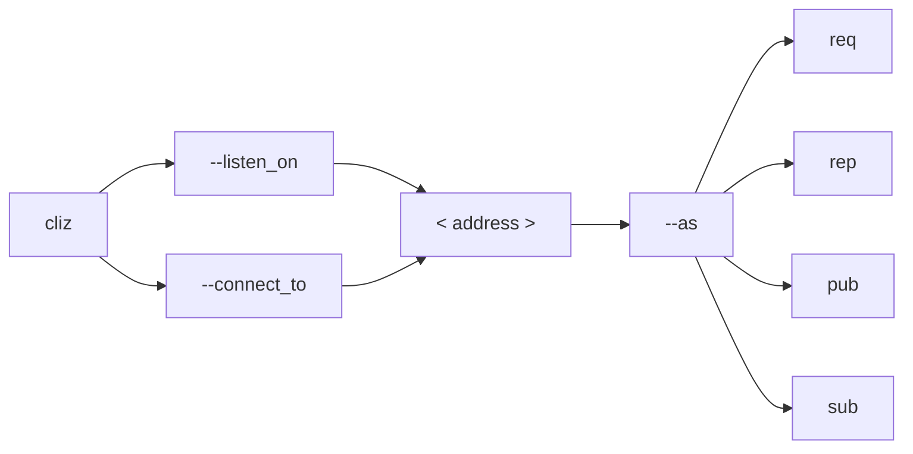
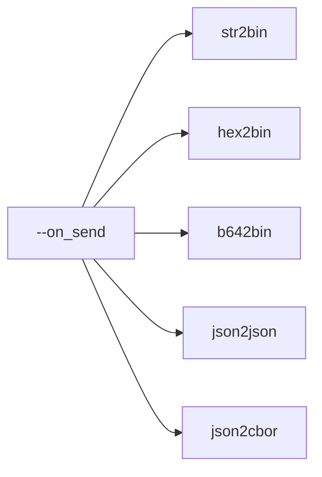
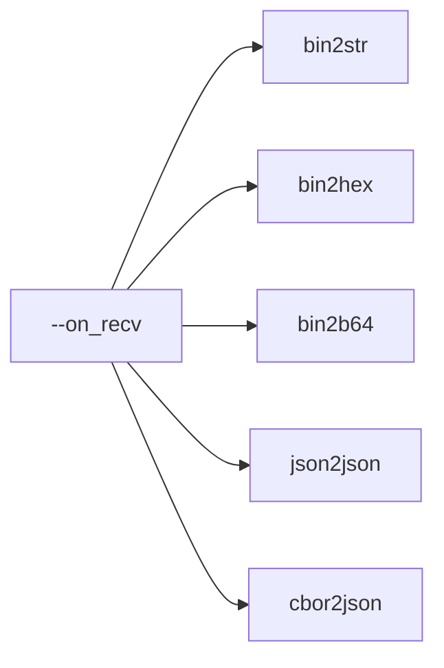

# cliz

A minimalisstic ZMQ CLI tool that offers filters to send/recv data (hex, b64, json, cbor, str).

```bash
./cliz --connect_to "tcp://localhost:12345" --as "sub" --on_recv "bin2hex"
```

## Dependencies

They are handled by Conan. Therefore, the only *actual* dependencies are **Python** and **g++**. Here is [how to install it](https://docs.conan.io/1/installation.html#install-with-pip-recommended). To summarize: create a Python virtual environment, activate it, pip install conan.

Do not forget to create your Conan build profile. It has to be done once.

```bash
conan profile detect
```

## Build

The build is performed with Conan:

```bash
conan build . --build=missing
```

## Usage

The `cliz` executable has some mandatory options.

One of the following options must be passed:

* `--listen_on` if a **server** socket shall be created
* `--connect_to` if a **client** socket shall be created

The value associated to that option is the address to listen on, or connect to. Example: `"tcp://localhost:12345"`.

The `--as` option must be passed. Its associated value must be one of the following:

* `req`
* `rep`
* `pub`
* `sub`

The created socket will be of the chosen type (REQ, REP, PUB or SUB).



Optionally, the `--on_send` option can be passed. Its associated value must be one of the following:

* `str2bin` the input string is send *as is* on the socket
* `hex2bin` the input string is parsed as hexadecimal and transformed into binary data
* `b642bin` the input string is parsed as base64 and transformed into binary data
* `json2json` the input string is parsed as JSON (packed or not) and transformed into a packed JSON string
* `json2cbor` the input string is parsed as JSON (packed or not) and transformed into a CBOR binary buffer



Optionally, the `--on_recv` option can be passed. Its associated value must be one of the following:

* `bin2str` the received data are printed *as is*
* `bin2hex` the received data are converted into an hexadecimal string and then printed
* `bin2b64` the received data are converted into a base64 string and then printed
* `json2json` the received data are parsed as a JSON string (packed or not) and then pretty printed
* `cbor2json` the received data are parsed as CBOR data, converted into a JSON string and then pretty printed



Optionally, the `-v` option can be passed. Without it, only data are printed. With it, an initial message displays the socket metadata, and a prompt message is printed before each send/receive.


## Examples

Here are some examples:


| Bob                                                                                      |   wire (hex)   | Alice                                                                                         |
| ------------------------------------------------------------------------------------------ | :--------------: | ----------------------------------------------------------------------------------------------- |
| `./cliz --listen_on "tcp://*:12345" --as pub --on_send hex2bin`                          |               | `./cliz --connect_to "tcp://localhost:12345" --as sub`                                        |
| 4f6b                                                                                     |      4f6b      | Ok                                                                                            |
| `./cliz --listen_on "tcp://*:12345" --as req --on_send json2cbor --on_recv json2json -v` |               | `./cliz --connect_to "tcp://localhost:12345" --as rep --on_recv bin2b64 --on_send hex2bin -v` |
| Listening on tcp://*:12345 as req...                                                     |               | Connecting to tcp://localhost:12345 as rep...                                                 |
| >>> {"key":42}                                                                           | a1636b6579182a | ... oWNrZXkYKg==                                                                              |
| ... "Hello"                                                                              | 2248656c6c6f22 | >>> 2248656c6c6f22                                                                            |
